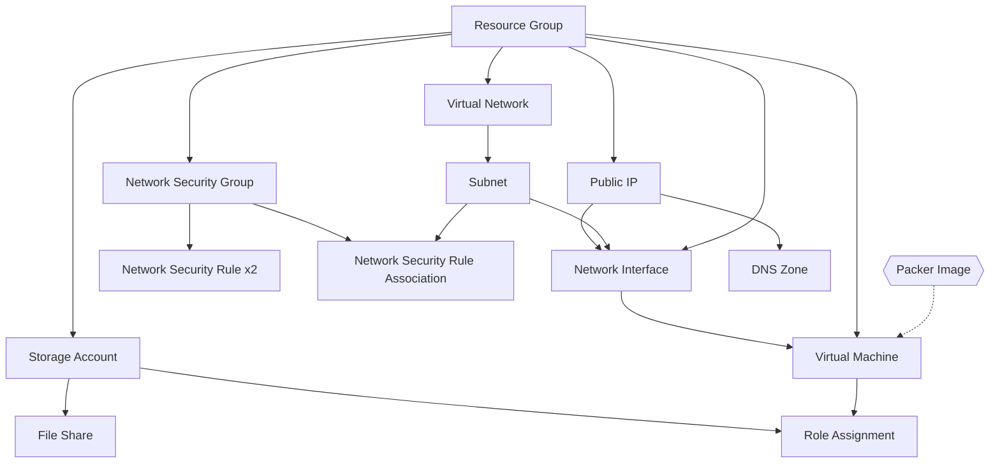

```mermaid
  graph TD;
      idRG[Resource Group]--> idSA[Storage Account];
      idSA-->idFS[File Share];
      idPI{{Packer Image}}-.->idVM[Virtual Machine]
      idRG-->idVN[Virtual Network];
      idVN-->idSN[Subnet];
      idRG-->idNSG[Network Security Group];
      idNSG-->idNSR[Network Security Rule x2];
      idSN-->idNSRA[Network Security Rule Association];
      idNSG-->idNSRA;
      idRG-->idPIP[Public IP];
      idRG-->idNI[Network Interface];
      idSN-->idNI;
      idPIP-->idNI
      idRG-->idVM;
      idNI-->idVM;
      idVM-->idRA[Role Assignment];
      idSA-->idRA;
      idPIP-->idDNSZ[DNS Zone];
```